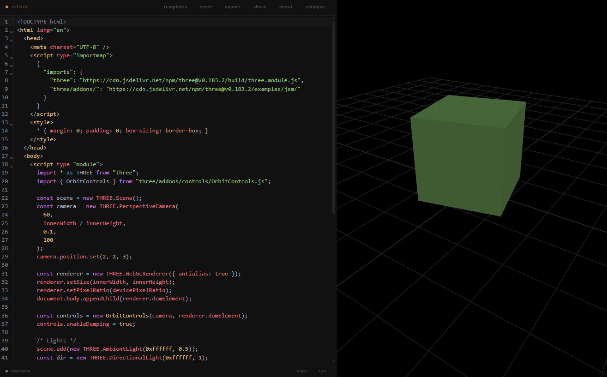

# HTML Live Editor

A fast, lightweight HTML editor with live preview — built with vanilla JS and CodeMirror 6.

Write HTML, CSS, and JavaScript in a single pane and see the result update instantly in a side-by-side preview. No backend, no accounts — everything runs in your browser.



## Features

- **Live preview** — updates as you type
- **CodeMirror 6** — syntax highlighting, auto-complete, bracket matching (One Dark theme)
- **Console panel** — intercepts `console.log`, `console.warn`, `console.error` from the preview; includes an expression input for quick evaluation
- **Auto-save** — editor content persists in localStorage automatically
- **Share via URL** — compress your code into a shareable link (LZ-string encoded hash)
- **Export** — download the current code as a standalone `.html` file
- **Templates** — start from pre-built templates (blank, JS script, Three.js, …)
- **Resizable layout** — draggable divider between editor and preview
- **Collapsible editor** — toggle the editor pane with a button or `Ctrl+E`
- **Mobile-friendly** — tab-based navigation on small screens

## Getting Started

### Prerequisites

- [Node.js](https://nodejs.org/) 18+

### Install & Run

```bash
git clone https://github.com/TomPast/html-live-edtitor.git
cd html-live-edtitor
npm install
npm run dev
```

Open [http://localhost:5173](http://localhost:5173) in your browser.

### Build for Production

```bash
npm run build
npm run preview   # preview the production build locally
```

The output is in the `dist/` directory — deploy it to any static hosting (Netlify, Vercel, GitHub Pages, etc.).

## Project Structure

```
html-live-editor/
├── index.html            # Vite entry point
├── public/
│   └── favicon.svg
└── src/
    ├── main.js           # CodeMirror setup + preview logic
    ├── panel.js           # Resizable layout, collapse/expand
    ├── console.js         # Console panel (intercept + eval)
    ├── storage.js         # localStorage auto-save/restore
    ├── export.js          # Download as .html
    ├── share.js           # Shareable URL encoding
    ├── templates.js       # Template loading
    ├── info.js            # About modal
    ├── style.css          # Layout + glass morphism styling
    └── templates/
        ├── blank.html
        ├── js-script.html
        └── threejs.html
```

## Tech Stack

| Layer       | Choice                                            |
| ----------- | ------------------------------------------------- |
| Build tool  | [Vite](https://vitejs.dev/)                       |
| Code editor | [CodeMirror 6](https://codemirror.net/)           |
| URL sharing | [lz-string](https://github.com/pieroxy/lz-string) |
| Framework   | None — vanilla JS/CSS                             |

## License

This project is open source and available under the [MIT License](LICENSE).
